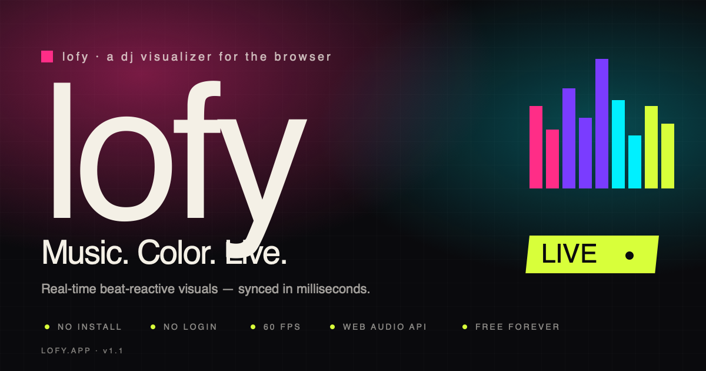

# lofy

> Music. Color. Live.
> A browser-native DJ visualizer that turns audio into real-time color, light, and motion.

[](LICENSE)
[](https://lofy.vizleo.com)
[](https://lofy.vizleo.com)



---

## What is lofy?

lofy is a real-time music visualizer that runs entirely in your browser. Drop in a track, capture system audio, or just turn on your mic — lofy listens to the music and paints the canvas in sync. No install, no login, no servers.

Built for:

- **DJs** running visuals at clubs and parties (fullscreen on a projector or TV)
- **Music listeners** who want their screen to react to whatever's playing
- **Streamers** adding a beat-reactive overlay to their stream

## Features

**Party Rooms (v2.0)** — sync the visuals across every device in the room
- "Start a Party Room" → host generates a QR code or a 4-letter code
- Guests scan the QR (in-person) or type the code (remote)
- Every screen flashes the same color on every kick, in real time
- **Your device is the server.** No backend, no accounts, no ongoing cost
- Audio stays on the host's device — only beat events cross the wifi
- Built on WebRTC data channels with PeerJS's free public broker for remote joins

**Four visual modes**
- **Spectrum** — log-frequency bars with palette gradient and peak dots
- **Beat Flash** — full-canvas color slams on every kick, with subtle ambient drift
- **Particle Storm** — radiating bursts from center, scaled by mid-band energy
- **Waveform** — phosphor-style oscilloscope with palette gradient

**Four audio sources**
- Microphone (no permission needed for the built-in demo loop)
- File upload (MP3, WAV, OGG, FLAC, AAC) — audio never leaves your device
- Tab capture (Chrome/Edge) — visualize Spotify, YouTube, anything
- Built-in demo loop — synthesized 128 BPM track for instant gratification

**Pro-grade DSP**
- A-weighted RMS for perceptual loudness
- Dual analyser pipeline (smooth spectrum + snappy beat detection)
- Spectral-flux + kick-band hybrid onset detection — works on tracks without a kick
- Octave correction and jitter rejection on BPM tracking
- Strobe safety guard (3 Hz cap, default on)

**Palette + control**
- 10 built-in palettes including the rainbow-strobe **Rainbow Rave**
- Custom 4-color palette builder, saved to localStorage
- Sensitivity + reactivity sliders, hue rotation, FPS overlay
- Tap-tempo BPM override (click the BPM badge, or press `T`)
- 30-second clip recording (Chrome) via `MediaRecorder`
- Share a preset as a URL hash (`#m=flash&p=...`)
- Installable as a PWA — runs offline after first visit

## How Party Rooms work

```
Host device                                       Guest devices (1..N)
─────────────                                      ─────────────────────
mic / file / tab audio                            no local audio needed
        ↓
BeatDetector + Visualizer       ◀═ WebRTC P2P ═▶  Visualizer (follower mode)
        ↓                          data channel          ↑
broadcast { beat, palette,      ──────────────▶   render the same visuals
            mode, sens, react }                   using received beat events
```

**The host's browser tab IS the server.** It holds the room state, detects beats from its own audio, and broadcasts compact JSON events (~5 messages per second per guest) over a WebRTC data channel.

**Two ways to connect:**

1. **In-person (QR codes)** — truly zero servers. Host shows a QR, guest scans it with their phone camera. Guest's browser generates an answer QR, host scans it back. WebRTC connection opens directly between the two devices.
2. **Remote (4-letter code)** — host types a code, guest types the same code on their device. Uses PeerJS's free public broker for the ~1-second WebRTC handshake, then it's pure peer-to-peer.

**Trade-offs:** ~10-20% of restrictive cellular networks may fail to connect (we don't run a TURN server). Wifi connections are nearly 100% reliable. If the host closes their tab, the room dissolves and guests return to solo mode.

## Keyboard shortcuts

| Key | Action |
|---|---|
| `1` / `2` / `3` / `4` | Switch to Spectrum / Flash / Particles / Waveform |
| `M` | Cycle audio source (Mic / File / Tab / Demo) |
| `Space` | Play / pause file source |
| `←` / `→` | Sensitivity ±1 (or BPM ±1 when manual tempo is locked) |
| `T` | Tap tempo (also clickable on the BPM badge) |
| `F` | Toggle fullscreen |
| `P` | Open Presets sheet |
| `R` | Start / stop 30-second recording |
| `S` | Copy share-preset URL |
| `?` | Show all keyboard shortcuts |
| `Esc` | Close any open overlay |

## Try it

**Live:** **[lofy.vizleo.com](https://lofy.vizleo.com)** — no install required.

**Locally:**

```bash
git clone https://github.com/amany2301/lofy.git
cd lofy
python3 -m http.server 5173
# open http://localhost:5173
```

That's it. No build step. No dependencies. No package.json.

**As a PWA:** open lofy.vizleo.com in Chrome / Edge / Brave, then look for the "Install lofy" prompt in the address bar or app menu. After install it works offline.

## Tech stack

Pure vanilla — no frameworks.

- HTML / CSS / vanilla ES modules
- Web Audio API (`AnalyserNode`, `DynamicsCompressorNode`, `BiquadFilterNode`, `OfflineAudioContext`)
- Canvas 2D rendering at 60 fps
- `MediaRecorder` + `canvas.captureStream` for clip recording
- `RTCPeerConnection` + WebRTC data channels for Party Rooms
- `getUserMedia` (camera) + `jsQR` for QR scanning
- PeerJS free public broker for remote-code signaling
- Service worker for offline + cached assets
- Cloudflare Workers for hosting (auto-deploy on push to `main`)

## Browser support

| Browser | Mic | File | Tab capture | Recording |
|---|---|---|---|---|
| Chrome 90+ | ✓ | ✓ | ✓ | ✓ |
| Edge 90+ | ✓ | ✓ | ✓ | ✓ |
| Firefox 90+ | ✓ | ✓ | ✗ | ✓ |
| Safari 14+ | ✓ | ✓ | ✗ | partial |
| Mobile Chrome | ✓ | ✓ | ✗ | ✓ |
| Mobile Safari | ✓ | ✓ | ✗ | ✗ |

Unsupported features gracefully disable their UI buttons.

## Project layout

```
.
├── index.html              # Landing page
├── app.html                # Visualizer app
├── manifest.json           # PWA manifest
├── sw.js                   # Service worker
├── css/                    # Shared + landing + app styles
├── js/
│   ├── app.js              # App entry point
│   ├── audio.js            # Web Audio engine (two-branch graph)
│   ├── bpm.js              # Beat / BPM detection (kick + spectral flux)
│   ├── visualizer.js       # Render loop, mode dispatch, A-weighting, follower mode
│   ├── controls.js         # UI wiring — pills, sliders, keyboard, room flows
│   ├── palettes.js         # 10 palettes incl. party-mode strobe
│   ├── presets.js          # localStorage persistence
│   ├── recorder.js         # 30s WebM clip capture
│   ├── share.js            # Preset URL encode/decode
│   ├── demo-audio.js       # Synthesized demo loop generator
│   ├── sync.js             # Party Rooms — RoomHost / RoomGuest over WebRTC
│   ├── qr-signal.js        # Party Rooms — QR encode/decode + camera scanner
│   ├── peer-signal.js      # Party Rooms — PeerJS broker for remote join
│   └── modes/
│       ├── spectrum.js
│       ├── flash.js
│       ├── particles.js
│       └── waveform.js
└── assets/                 # Icons, OG image, screenshots
```

## Privacy

lofy processes all audio **locally in your browser**. Files you load and microphone input are never uploaded to any server. The only network requests are:

- HTML / CSS / JS / icons (Cloudflare CDN)
- Google Fonts (served by Google)

No analytics, no trackers, no third-party scripts. The repo is MIT-licensed; you can self-host any time.

## Contributing

Bugs and feature ideas welcome — [open an issue](https://github.com/amany2301/lofy/issues). PRs welcome too; there's no build step or test runner yet, so just open the diff and we can chat.

## License

[MIT](LICENSE) — © 2026 Aman Kumar Yadav. Use it however you like; just keep the copyright.

## Acknowledgements

Built in a single weekend with help from Claude. DSP design inspired by [Joe Sullivan's onset-detection notes](https://www.parallelcube.com/2018/03/15/onset-detection/) and the Web Audio API community.
